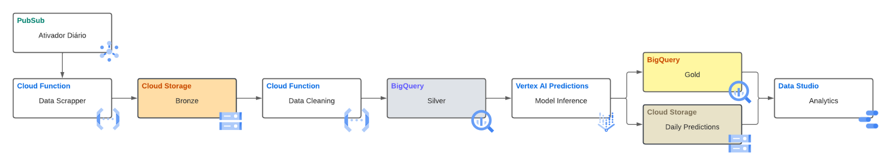

Processamento Massivo de Dados 2023
=====
Esse repositório corresponde a implementação do trabalho final da disciplina de Processamento Massivo de Dados 2023/2. 

Alguns experimentos em forma de Jupyter Notebooks também estão inclusos, além do código-fonte da implementação da Arquitetura de Dados para Análise de Sentimento de Reviews do Google Play 


## :cloud: Arquitetura de Dados na GCP



<!-- CREDITS -->
## :scroll: Credits

### José Rafael Rebêlo

[](https://github.com/joserafaelrebelo)
[]()

### Letícia Mendes

[](https://github.com/mendesLet)
[](https://br.linkedin.com/in/leticia-lima-mendes-7687ab1a3)


<!-- 
This repository contains software for enabling human interactions with Miss Piggy, the @home robot from Pequi Mecânico. The system relies on various dependencies and components, ensuring communication and operation.


## Dependencies

- nvidia-riva-client (version 2.9.0)
    - An instance of the Riva Server is also needed.
- Miss Piggy HRI modules
    - miss_asr
    - miss_tts
    - miss_nlu
    - miss_wakeword     
- PyAudio
- sounddevice
- [...] < TBD >


## Verifying Sound Card Detection
To check if your microphone and sound card are properly detected by your system, you can use the following command:

```sh 
python3 -m sounddevice
```

## Getting started
### Start the Docker Container
You can start the required Docker container by running the following command:
```sh 
docker-compose -f docker-compose.yaml run hri bash
```

### Set up ROS
You'll need to build the necessary ROS packages. Use the following commands to build and set up the packages:

```sh 
colcon build -symlink-install
```
```sh 
source install/setup.bash
```

### Start the Servers
Miss Piggy Human Interaction involves various ROS servers. To start them, execute the following commands:
```sh 
ros2 launch lazy_qa qa_servers.launch.py
```
Executing the question and answer task
```sh 
ros2 run lazy_qa qa
``` -->
